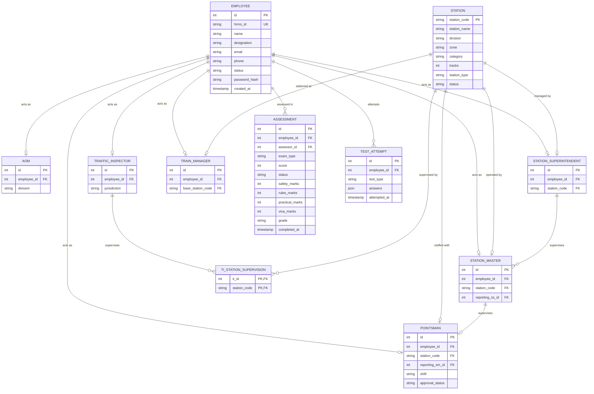

# 🚂 Indian Railways DBMS Schema Design
This document provides the full Relational Database Management System (DBMS) schema, entity relationships, and SQL DDL scripts to migrate the frontend `localStorage` database to a robust relational database (e.g., PostgreSQL, SQLite, or MySQL).

It includes all 7 operational and administrative roles:
1. 👑 **Super Admin** (Full system access)
2. 👔 **AOM** (Assistant Operations Manager - Divisional head)
3. 🕵️ **TI** (Traffic Inspector - Jurisdictional auditor)
4. 🏢 **SS** (Station Superintendent / SI - Station supervisor)
5. 🟢 **SM** (Station Master - Shift supervisor)
6. 🚩 **PM** (Pointsman - Shunting and operations)
7. 🚄 **TM** (Train Manager / Guard - On-board train lead)

---

## 🎨 Database Schema Visual Blueprint
Below is the visual relational diagram illustrating all tables, keys, and connections:


---

## 📊 Entity-Relationship (ER) Diagram
Below is the interactive Mermaid diagram illustrating how all the railway modules are linked:



---

## 🗄️ Relational Database Schema Tables

### 1. `employees`
Stores all staff profiles, designations, contact info, and security credentials.
- `id` (INT PK, Auto-increment): Unique identifier for database operations.
- `hrms_id` (VARCHAR(50) UK, NOT NULL): The official Indian Railways HRMS ID.
- `name` (VARCHAR(150), NOT NULL): Employee's full name.
- `designation` (VARCHAR(100), NOT NULL): E.g., 'Super Admin', 'AOM', 'Traffic Inspector', 'Station Superintendent', 'Station Master', 'Pointsman', 'Train Manager'.
- `email` (VARCHAR(100) UNIQUE, NULL): Email address.
- `phone` (VARCHAR(20), NULL): Contact number.
- `status` (VARCHAR(20), DEFAULT 'Active'): E.g., 'Active', 'Inactive'.
- `password_hash` (VARCHAR(255), NOT NULL): Secure hashed password.
- `created_at` (TIMESTAMP DEFAULT NOW())

### 2. `stations`
Stores the infrastructure configuration of all stations under Zonal/AOM jurisdiction.
- `station_code` (VARCHAR(10) PK): Station Code (e.g. 'ALKEM', 'CIPLA').
- `station_name` (VARCHAR(100), NOT NULL): Full station name.
- `division` (VARCHAR(50), NOT NULL): Mapped division (e.g. 'Mumbai', 'Delhi').
- `zone` (VARCHAR(50), NOT NULL): Mapped railway zone (e.g. 'CR', 'WR').
- `category` (VARCHAR(20)): Infrastructure category (e.g., 'NSG-1', 'NSG-2').
- `tracks` (INT, DEFAULT 2): Number of parallel tracks at the station.
- `station_type` (VARCHAR(50)): E.g., 'Junction', 'Terminal', 'Way Station'.
- `status` (VARCHAR(20), DEFAULT 'Active')

### 3. `aoms`
Assistant Operations Managers linked to employees and managing a division.
- `id` (INT PK, Auto-increment)
- `employee_id` (INT FK -> `employees.id`, UNIQUE, NOT NULL)
- `division` (VARCHAR(50), NOT NULL)

### 4. `traffic_inspectors`
Profiles for Traffic Inspectors, linked to employees and a jurisdiction division.
- `id` (INT PK, Auto-increment)
- `employee_id` (INT FK -> `employees.id`, UNIQUE, NOT NULL)
- `jurisdiction` (VARCHAR(50), NOT NULL): Supervising division.

### 5. `station_superintendents`
Station Superintendents (SS) heading larger class-A stations.
- `id` (INT PK, Auto-increment)
- `employee_id` (INT FK -> `employees.id`, UNIQUE, NOT NULL)
- `station_code` (VARCHAR(10) FK -> `stations.station_code`, UNIQUE, NOT NULL)

### 6. `station_masters`
Profiles for Station Masters, linked to employees and managing a specific station.
- `id` (INT PK, Auto-increment)
- `employee_id` (INT FK -> `employees.id`, UNIQUE, NOT NULL)
- `station_code` (VARCHAR(10) FK -> `stations.station_code`, NOT NULL)
- `reporting_ss_id` (INT FK -> `station_superintendents.id`, NULL)

### 7. `pointsmen`
Profiles for Pointsmen, linked to their station and reporting Station Master.
- `id` (INT PK, Auto-increment)
- `employee_id` (INT FK -> `employees.id`, UNIQUE, NOT NULL)
- `station_code` (VARCHAR(10) FK -> `stations.station_code`, NOT NULL)
- `reporting_sm_id` (INT FK -> `station_masters.id`, NULL)
- `shift` (VARCHAR(10), DEFAULT 'Day'): Current operational shift ('Day', 'Night', 'Continuous').
- `approval_status` (VARCHAR(20), DEFAULT 'Pending'): Approval from TI/AOM.

### 8. `train_managers`
Train Managers (Guards) operating out of a specific base station.
- `id` (INT PK, Auto-increment)
- `employee_id` (INT FK -> `employees.id`, UNIQUE, NOT NULL)
- `base_station_code` (VARCHAR(10) FK -> `stations.station_code`, NOT NULL)

### 9. `ti_station_supervision`
Junction table showing which stations a Traffic Inspector supervises.
- `ti_id` (INT FK -> `traffic_inspectors.id`, PK)
- `station_code` (VARCHAR(10) FK -> `stations.station_code`, PK)

### 10. `assessments`
Tracks formal assessments, scores, grade metrics, and supervisor feedback.
- `id` (INT PK, Auto-increment)
- `employee_id` (INT FK -> `employees.id`, NOT NULL)
- `assessor_id` (INT FK -> `employees.id`, NOT NULL)
- `exam_type` (VARCHAR(50), NOT NULL): E.g., 'Routine', 'Refresher', 'Safety Audit'.
- `score` (INT, NOT NULL): Overall grade score out of 100.
- `status` (VARCHAR(20), DEFAULT 'Completed'): E.g. 'Pending', 'In Progress', 'Completed'.
- `safety_marks` (INT DEFAULT 0)
- `rules_marks` (INT DEFAULT 0)
- `practical_marks` (INT DEFAULT 0)
- `viva_marks` (INT DEFAULT 0)
- `grade` (VARCHAR(5)): Calculated grade (A, B, C, F).
- `completed_at` (TIMESTAMP DEFAULT NOW())

### 11. `test_attempts`
Saves details of MCQ tests taken by Pointsmen and Station Masters.
- `id` (INT PK, Auto-increment)
- `employee_id` (INT FK -> `employees.id`, NOT NULL)
- `test_type` (VARCHAR(50), NOT NULL): MCQ test identification.
- `answers` (JSONB, NOT NULL): Detailed JSON payload of answers given.
- `attempted_at` (TIMESTAMP DEFAULT NOW())

---

## 🖨️ PostgreSQL DDL Script

You can copy and run this DDL script in any standard database console to create the relations:

```sql
-- Create employees table
CREATE TABLE employees (
    id SERIAL PRIMARY KEY,
    hrms_id VARCHAR(50) UNIQUE NOT NULL,
    name VARCHAR(150) NOT NULL,
    designation VARCHAR(100) NOT NULL,
    email VARCHAR(100) UNIQUE,
    phone VARCHAR(20),
    status VARCHAR(20) DEFAULT 'Active',
    password_hash VARCHAR(255) NOT NULL,
    created_at TIMESTAMP DEFAULT CURRENT_TIMESTAMP
);

-- Create stations table
CREATE TABLE stations (
    station_code VARCHAR(10) PRIMARY KEY,
    station_name VARCHAR(100) NOT NULL,
    division VARCHAR(50) NOT NULL,
    zone VARCHAR(50) NOT NULL,
    category VARCHAR(20),
    tracks INT DEFAULT 2,
    station_type VARCHAR(50),
    status VARCHAR(20) DEFAULT 'Active'
);

-- Create aoms table
CREATE TABLE aoms (
    id SERIAL PRIMARY KEY,
    employee_id INT UNIQUE NOT NULL REFERENCES employees(id) ON DELETE CASCADE,
    division VARCHAR(50) NOT NULL
);

-- Create traffic_inspectors table
CREATE TABLE traffic_inspectors (
    id SERIAL PRIMARY KEY,
    employee_id INT UNIQUE NOT NULL REFERENCES employees(id) ON DELETE CASCADE,
    jurisdiction VARCHAR(50) NOT NULL
);

-- Create station_superintendents table
CREATE TABLE station_superintendents (
    id SERIAL PRIMARY KEY,
    employee_id INT UNIQUE NOT NULL REFERENCES employees(id) ON DELETE CASCADE,
    station_code VARCHAR(10) UNIQUE REFERENCES stations(station_code) ON DELETE SET NULL
);

-- Create station_masters table
CREATE TABLE station_masters (
    id SERIAL PRIMARY KEY,
    employee_id INT UNIQUE NOT NULL REFERENCES employees(id) ON DELETE CASCADE,
    station_code VARCHAR(10) NOT NULL REFERENCES stations(station_code) ON DELETE CASCADE,
    reporting_ss_id INT REFERENCES station_superintendents(id) ON DELETE SET NULL
);

-- Create pointsmen table
CREATE TABLE pointsmen (
    id SERIAL PRIMARY KEY,
    employee_id INT UNIQUE NOT NULL REFERENCES employees(id) ON DELETE CASCADE,
    station_code VARCHAR(10) NOT NULL REFERENCES stations(station_code) ON DELETE CASCADE,
    reporting_sm_id INT REFERENCES station_masters(id) ON DELETE SET NULL,
    shift VARCHAR(10) DEFAULT 'Day',
    approval_status VARCHAR(20) DEFAULT 'Pending'
);

-- Create train_managers table
CREATE TABLE train_managers (
    id SERIAL PRIMARY KEY,
    employee_id INT UNIQUE NOT NULL REFERENCES employees(id) ON DELETE CASCADE,
    base_station_code VARCHAR(10) NOT NULL REFERENCES stations(station_code) ON DELETE CASCADE
);

-- Create TI to station supervision junction table
CREATE TABLE ti_station_supervision (
    ti_id INT REFERENCES traffic_inspectors(id) ON DELETE CASCADE,
    station_code VARCHAR(10) REFERENCES stations(station_code) ON DELETE CASCADE,
    PRIMARY KEY (ti_id, station_code)
);

-- Create assessments table
CREATE TABLE assessments (
    id SERIAL PRIMARY KEY,
    employee_id INT NOT NULL REFERENCES employees(id) ON DELETE CASCADE,
    assessor_id INT NOT NULL REFERENCES employees(id) ON DELETE CASCADE,
    exam_type VARCHAR(50) NOT NULL,
    score INT NOT NULL,
    status VARCHAR(20) DEFAULT 'Completed',
    safety_marks INT DEFAULT 0,
    rules_marks INT DEFAULT 0,
    practical_marks INT DEFAULT 0,
    viva_marks INT DEFAULT 0,
    grade VARCHAR(5),
    completed_at TIMESTAMP DEFAULT CURRENT_TIMESTAMP
);

-- Create test_attempts table
CREATE TABLE test_attempts (
    id SERIAL PRIMARY KEY,
    employee_id INT NOT NULL REFERENCES employees(id) ON DELETE CASCADE,
    test_type VARCHAR(50) NOT NULL,
    answers JSONB NOT NULL,
    attempted_at TIMESTAMP DEFAULT CURRENT_TIMESTAMP
);
```
